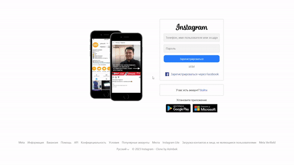

<h1 align="center">REALTIME INSTAGRAM - CLONE</h1>

  

<h2 align="center">Как пользоваться ?</h2>

1. Регистрируем аккаунт (данные могут быть фейковыми).
2. После регистрации и входа, нажимаем на кнопку "Создать" с иконкой знака '+', затем загружаем картинку (описание можете добавить по желанию), после нажимаем на кнопку "Опубликовать".
3. Так же можно выйти с аккаунта, нажав на кнопку "Переключиться" на правой верхней стороне или же нажав на красную кнопку с иконкой двери, после чего вы сможете заново войти в свою ранее созданную учетную запись или же создать новую.
